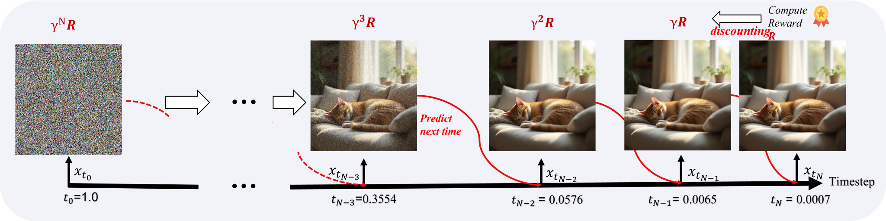

<div align="center">

<h1>Schedule On the Fly: Diffusion Time Prediction for Faster and Better Image Generation</h1>

<p align="center">
<a href="https://arxiv.org/abs/2412.01243"></a>
<a href="https://huggingface.co/MAPLE-WestLake-AIGC/TPDM"></a>
</p>

[MAPLE Lab, Westlake University](https://maple.lab.westlake.edu.cn/)

</div>



- In this paper, we view denoising steps as a kind of chain-of-thought in image generation, and introduce the Time Prediction Diffusion Model (TPDM) that adaptively predicts the next diffusion time to denoise images in the reverse diffusion process.
TPDM adjusts the noise schedule for each prompt individually. By aligning the final outputs of the denoising process with human preferences, TPDM can reduce the number of inference steps by almost 50% while still keeping image quality.

- Our paper is accepted at CVPR 2025.


## Visualization of the Predicted Schedules


## Getting start for inference
### Download SD3 Pretrained Model

```shell
mkdir models
pip install -r requirements.txt

# if you are in mainland china, you can use the mirror to accelerate download
# export HF_ENDPOINT=https://hf-mirror.com
huggingface-cli download stabilityai/stable-diffusion-3-medium-diffusers --local-dir models/stabilityai/stable-diffusion-3-medium
```

### Download TPM Checkpoints

```shell
huggingface-cli download MAPLE-WestLake-AIGC/TPDM --local-dir checkpoint
# subdir sd3 is stable diffusion 3 checkpoint
```

### Launch Gradio Web For Inference

```shell
python gradio_sd3_inference.py
```

## Getting start for training

If you want to train TPDM, you should prepare prompts and organize it like exmaple/example.jsonl.

Original datasets we used can be download in [COCO](https://cocodataset.org/#home), [COYO-11M](https://huggingface.co/datasets/CaptionEmporium/coyo-hd-11m-llavanext) and [Laion-Art](https://huggingface.co/datasets/laion/laion-art)

```shell
huggingface-cli download --resume-download THUDM/ImageReward --local-dir models/THUDM/ImageReward
bash scripts/launch_sd3_train.sh
```

## Acknowledgement
Thanks to huggingface team for open-sourcing the [trl](https://github.com/huggingface/trl) and [diffusers](https://github.com/huggingface/diffusers) library, which part of our code is based on.

## Citation
If you find our paper or code useful, wish you can cite our paper.
```
@misc{ye2025scheduleflydiffusiontime,
      title     = {Schedule On the Fly: Diffusion Time Prediction for Faster and Better Image Generation}, 
      author    = {Zilyu Ye and Zhiyang Chen and Tiancheng Li and Zemin Huang and Weijian Luo and Guo-Jun Qi},
      booktitle = {Proceedings of the IEEE/CVF Conference on Computer Vision and Pattern Recognition (CVPR)},
      month     = {June},
      year      = {2025},
      url       = {https://arxiv.org/abs/2412.01243}, 
}
```
